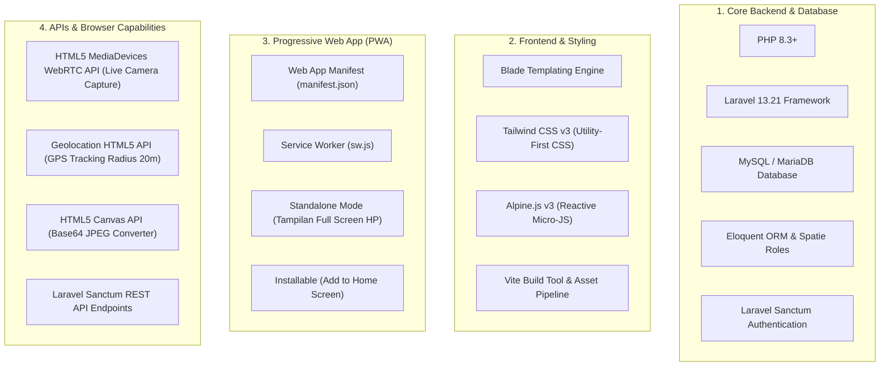

# 🛠️ Modul Spesifikasi Teknologi, CSS Framework, API & Progressive Web App (PWA)

Dokumen ini menjelaskan secara rinci seluruh **Teknologi Backend, Frontend, CSS Framework, API (Native Browser & REST API), serta Fitur Progressive Web App (PWA)** yang digunakan dalam pembangunan **Sistem Informasi Akademik (SIAKAD) SMPN 13 Sungai Raya**.

---

## 📌 Daftar Ringkasan Arsitektur Teknologi



---

## 📱 1. Modul Progressive Web App (PWA)

SIAKAD SMPN 13 Sungai Raya **SUDAH MENGGUNAKAN PWA (Progressive Web App)** lengkap dengan spesifikasi berikut:

### 1.1 Berkas Manifest Aplikasi (`public/manifest.json`)
- **Nama Aplikasi**: `"Sistem Akademik SMPN 13"`
- **Nama Pendek di HP**: `"SIAKAD 13"`
- **Mode Tampilan**: `"display": "standalone"` (*Aplikasi terbuka penuh tanpa baris alamat URL browser, terasa persis seperti aplikasi native Android/iOS*).
- **Warna Tema**: `"theme_color": "#0f172a"` (Dark Navy).
- **Orientasi**: `"orientation": "portrait"`.
- **Ikon Aplikasi**: Ikon transparan `512x512` maskable untuk tampilan ikon di layar HP.

### 1.2 Service Worker (`public/sw.js`)
- Berkas skrip Service Worker yang mendaftar di latar belakang (*background*) browser untuk menangani pembaruan aplikasi dan siklus hidup PWA (`install`, `activate`, `fetch`).

### 1.3 Registrasi pada Layout Utama (`resources/views/layouts/app.blade.php`)
```html
<link rel="manifest" href="/manifest.json">
<meta name="theme-color" content="#0f172a">

<script>
    if ('serviceWorker' in navigator) {
        window.addEventListener('load', () => {
            navigator.serviceWorker.register('/sw.js')
                .then(reg => console.log('Service worker registered.', reg))
                .catch(err => console.log('Service worker registration failed: ', err));
        });
    }
</script>
```

### 1.4 Cara Pengguna Menginstal PWA ke HP / Laptop:
1. Buka website `http://127.0.0.1:8000` via Chrome / Edge / Safari pada HP Android, iPhone, atau Laptop.
2. Klik menu opsi browser (titik tiga) atau tombol prompt **"Tambahkan ke Layar Utama"** (*Add to Home Screen*) / **"Install Aplikasi SIAKAD 13"**.
3. Ikon **SIAKAD 13** akan muncul di layar utama (*Homescreen*) HP/Laptop dan dapat dibuka langsung sebagai aplikasi mandiri.

---

## 💻 2. Core Backend & Database

| Teknologi | Versi | Fungsi & Peranan dalam Sistem |
| :--- | :---: | :--- |
| **PHP** | `v8.3+` | Bahasa pemrograman utama server-side. |
| **Laravel** | `v13.21` | Framework MVC utama untuk menangani routing, controller, service layer, dan middleware keamanan. |
| **MySQL / MariaDB** | `v10.4+` | Database relasional untuk menyimpan tabel `users`, `students`, `teachers`, `academic_classes`, `grades`, `attendances`, dll. |
| **Spatie Permission** | `v6.x` | Library manajemen Role & Hak Akses (`admin`, `teacher`, `siswa`, `guru-bk`). |
| **Laravel Sanctum** | `v4.x` | Sistem autentikasi token aman berbasis API & Session Guard. |

---

## 🎨 3. CSS Framework & UI Aesthetic

### 3.1 CSS Framework: **Tailwind CSS v3**
Proyek ini menggunakan **Tailwind CSS v3** yang terintegrasi langsung melalui bundler **Vite** (`resources/css/app.css` & `resources/js/app.js`).

### 3.2 Keunggulan Penggunaan Tailwind CSS dalam SIAKAD:
1. **Utility-First Styling**: Seluruh tampilan UI (tombol, card, tabel, modal, badge status) dibangun menggunakan utility class Tailwind tanpa perlu menulis file CSS terpisah yang gemuk.
2. **Skema Warna Kurasi Modern (Dark Navy & Gold Slate)**:
   - Warna Utama: `navy` (`#0f172a` / `#1e293b`), `blue-900`
   - Warna Aksen/Highlight: `gold` (`#f5a623`), `yellow-500`
   - Warna Status: `emerald-600` (Hadir/Lulus), `amber-600` (Terlambat/Remedial), `red-600` (Alpha/SP)
3. **Desain Responsif (Responsive Grid System)**:
   - Menggunakan breakpoint Tailwind (`sm:`, `md:`, `lg:`, `xl:`) sehingga halaman dapat diakses dengan sempurna dari perangkat **Smartphone, Tablet, maupun Laptop/PC Desktop**.
4. **Custom Animations & Micro-Interactions**:
   - Efek transisi halus (`transition-all duration-300`), efek kaca melayang (`backdrop-blur-md`), dan pinging badge status real-time (`animate-ping`).

---

## 🌐 4. Penggunaan API (Native Browser APIs & REST API)

### Kategori A: **Native Browser Web APIs (API Perangkat Browser)**

1. **HTML5 MediaDevices / WebRTC API** (`navigator.mediaDevices.getUserMedia`):
   - **Kegunaan**: Digunakan pada fitur **Smart Capture Foto Absensi Siswa**.
   - **Mekanisme**: Mengakses sensor kamera depan perangkat siswa secara langsung untuk siaran video live (*Live Viewfinder*) di browser tanpa perlu memilih file gambar dari galeri HP/PC.

2. **HTML5 Geolocation API** (`navigator.geolocation.getCurrentPosition`):
   - **Kegunaan**: Pelacakan Lokasi Presisi Siswa.
   - **Mekanisme**: Mengambil titik koordinat latitude dan longitude GPS perangkat siswa secara real-time, lalu menghitung jaraknya (*Haversine Formula*) dari koordinat resmi SMPN 13 (Maksimal radius 20 meter).

3. **HTML5 Canvas API** (`canvas.getContext('2d').drawImage`):
   - **Kegunaan**: Capture Frame & Encode Gambar.
   - **Mekanisme**: Membekukan frame siaran kamera live saat siswa mengeklik tombol **Jepret Foto**, membalik cermin (*mirroring*), dan mengonversinya menjadi string gambar Base64 JPEG berkualitas tinggi.

---

### Kategori B: **Backend REST API Internal**

1. **Laravel Sanctum API Endpoints** (`routes/api.php`):
   - **Kegunaan**: Menyediakan endpoint RESTful API terproteksi berbasis JSON untuk autentikasi dan pertukaran data.
   - **Endpoint Utama**:
     - `POST /api/login`: Autentikasi API pengeluaran Bearer Token.
     - `GET /api/user`: Mengambil informasi profil pengguna terautentikasi.
     - `GET /api/student/records`: API data nilai siswa.
     - `POST /api/student/attendance`: API pengiriman data absensi.
